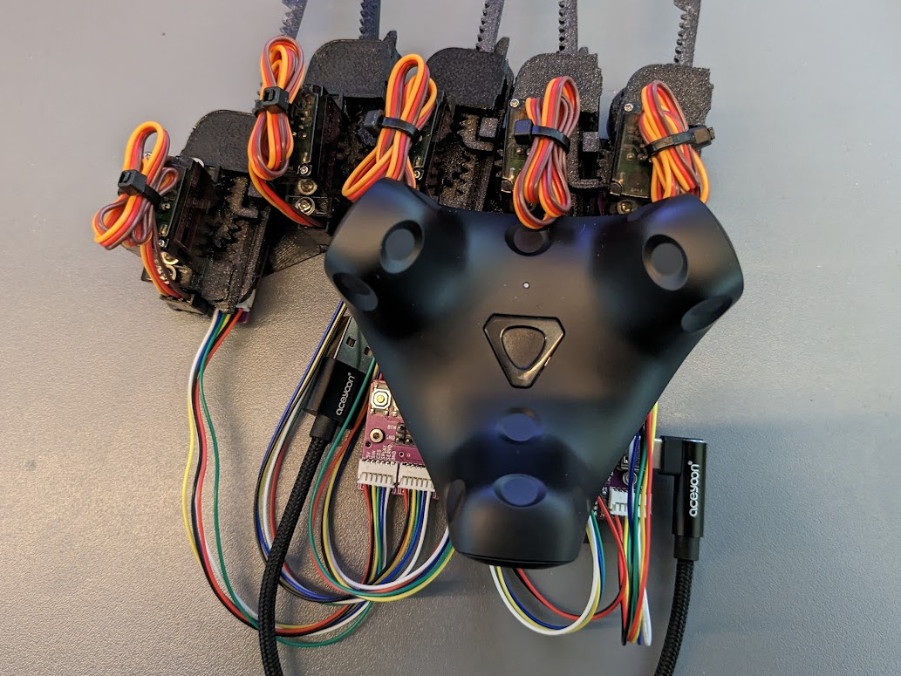
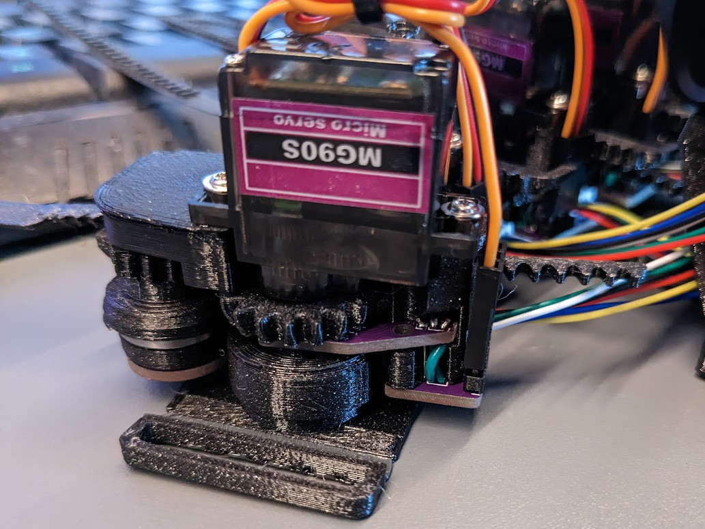
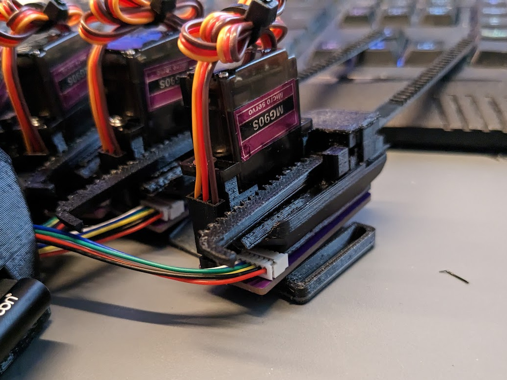

# LucidGloves Fae Mod

This repository contains files and instructions how to build the **LucidglovesFae Mod**, a mod of the
**[Lucidgloves Prototype 5](https://github.com/LucidVR/lucidgloves/tree/proto5) by Lucas VRTech**.

  
     
  

The mod presently consists of 3 features that can, in theory, be used seperately:

* Custom PCBs to greatly simplify the wiring and provide a compact control PCB featuring an ESP32-S3 chip and 
  most notably no need for a multiplexer chip. With the files provided they can be ordered directly from
  [JLCPCB](https://jlcpcb.com/) including most of the assembly.
* A modified sensor module that prints without supports and fits the new PCBs. It can also be used without the new PCBs.
* A two-material version of the RigidMount, that allows you to print part of it with flexible filament (TPU) so it
  flexes more nicely where it needs to. It can be used without the other parts of this mod. It can also be printed using
  a non-multi-material printer. 

## Cost

The additional parts, including the custom PCBs and shipping, will set you back ~$30 per glove for 2 gloves, or 
$20 per glove for 4 gloves. The reason for the massive price difference is that JLCPCB manufactures PCBs in multiples
of five, so you will order at least 5 control PCBs. You can have them only assemble 2, but the price
difference would be about $1. For the finger PCBs, the price barely increases if you order enough for 20 fingers instead
of 10 fingers. So, simply put: You might as well order enough parts for 4 gloves, and split the cost with a friend :)

Keep in mind this comes on top of the cost for the other parts you need for prototype 5 anyway, but you will not need 
the ESP dev module or the multiplexer chip, which will save you about $6-$7 per glove. You will also not need additional
cables as they are all included. In my opinion, the reduced hassle alone is worth the cost.

At the time of writing this, the cost of parts to build the LucidGloves Fae Mod including 3D printing filament and
all parts, according to my calculations, comes down to ~$60 per glove for 2 gloves and ~$40 per glove for 4 gloves.

Don't forget that you will still need to buy a SteamVR tracker of your choice for each glove thoguh, of course. 

## Important caveat

**The ESP32-S3 chip does not support BluetoothSerial. This means that, presently, the gloves can only
be connected using a wired USB connection.** The chip itself supports both Bluetooth Low Energy and WiFi for
communication, neither of these are currently implemented in the firmware or the 
[opengloves driver](https://github.com/LucidVR/opengloves-driver), though there seem to be plans to support
BLE for communication in the future.

If you're a developer and feel like implementing communication via WiFi/TCP/UDP or Bluetooth Low Energy in the
oopengloves driver and submit a pull request to it, i'm sure it would be appreciated by the community.
I don't have enough experience with software development on windows to do it myself. However, i am experienced
with firmware development and if someone added the support to the opengloves driver, i would probably be up to
implementing the other side of it for the firmware. 

## Instructions

- Ordering the parts needed (TBD)
- 3D Printing the modified parts (TBD)
- Assembling the modified parts (TBD)

